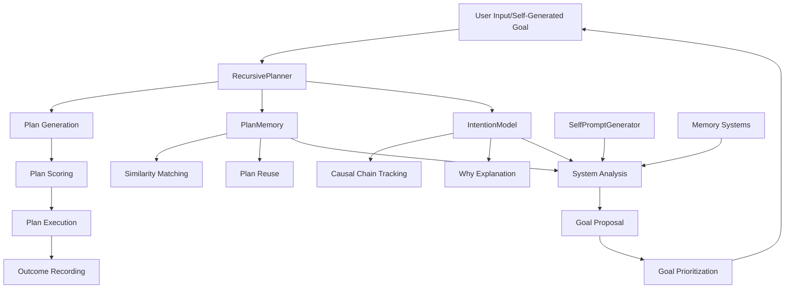

# MeRNSTA Phase 11: Recursive Planning System

## Overview

The Recursive Planning System represents a major evolutionary leap for MeRNSTA, transforming it from a reactive task follower into a proactive, self-directing, reasoning agent capable of:

- **Recursive Goal Decomposition**: Breaking complex objectives into manageable, actionable steps
- **Intention Chain Tracking**: Understanding and explaining the "why" behind every action
- **Autonomous Goal Generation**: Self-identifying improvement opportunities and generating goals
- **Plan Optimization**: Learning from past successes and failures to improve future planning
- **Long-term Strategic Thinking**: Maintaining coherent intention chains across multiple levels

## Architecture

### Core Components



### Component Details

#### 1. RecursivePlanner (`agents/recursive_planner.py`)

The core planning agent that orchestrates the entire recursive planning process.

**Key Methods:**
- `plan_goal(goal_text)`: Generates multi-step plans with intention tracking
- `score_plan(plan)`: Evaluates plan quality, feasibility, and coherence
- `execute_plan(plan)`: Executes plans step-by-step with progress tracking
- `reuse_similar_plan(goal_text)`: Finds and adapts existing successful plans

**Features:**
- **Recursive Decomposition**: Automatically breaks complex steps into sub-plans
- **Context Awareness**: Uses available memory and reflection data for better planning
- **Adaptive Reuse**: Learns from past plans to accelerate future planning
- **Quality Scoring**: Multi-dimensional plan evaluation for continuous improvement

#### 2. PlanMemory (`storage/plan_memory.py`)

Persistent storage system for plans with intelligent retrieval capabilities.

**Key Methods:**
- `store_plan(plan)`: Stores plans with full metadata and embeddings
- `get_similar_plans(goal_text)`: Semantic similarity matching for plan reuse
- `record_plan_outcome(plan_id, result)`: Tracks execution results for learning
- `get_plan_statistics()`: Provides analytics on planning performance

**Features:**
- **Semantic Similarity**: Uses embeddings to find conceptually similar plans
- **Success Tracking**: Maintains success rates and performance metrics
- **Outcome Learning**: Records what works and what doesn't for future reference
- **Efficient Storage**: Optimized database schema with proper indexing

#### 3. IntentionModel (`storage/intention_model.py`)

Tracks the causal chains of motivation and goal derivation.

**Key Methods:**
- `record_intention(goal_id, triggered_by, drive, importance, reflection_note)`: Records why a goal exists
- `trace_why(goal_id)`: Traces the complete causal chain behind a goal
- `link_goals(child_goal_id, parent_goal_id, relationship_note)`: Creates explicit goal relationships
- `get_motivational_patterns()`: Identifies patterns in motivation and goal creation

**Features:**
- **Causal Chain Tracking**: Maintains "why" relationships across goal hierarchies
- **Drive Classification**: Categorizes motivations into psychological drives
- **Pattern Recognition**: Identifies recurring motivational patterns
- **Self-Reflection Support**: Enables "Why am I doing this?" introspection

#### 4. SelfPromptGenerator (`agents/self_prompter.py`)

Autonomous goal generation agent that analyzes system state to propose improvements.

**Key Methods:**
- `propose_goals(context)`: Analyzes system performance to generate improvement goals
- `prioritize_goals(goals)`: Ranks goals by impact, feasibility, and urgency

**Features:**
- **Performance Analysis**: Examines memory, plans, and intentions for improvement opportunities
- **Pattern-Based Generation**: Uses configurable patterns to generate diverse goal types
- **Failure Learning**: Identifies common failure patterns to propose corrective actions
- **Success Amplification**: Recognizes successful approaches for scaling

## Data Structures

### Plan Structure

```python
@dataclass
class Plan:
    plan_id: str                    # Unique identifier
    goal_text: str                  # Human-readable goal description
    steps: List[PlanStep]           # Ordered list of steps
    plan_type: str                  # sequential, parallel, tree
    status: str                     # draft, active, completed, failed
    confidence: float               # Confidence in plan success (0.0-1.0)
    priority: int                   # Priority level (1=highest)
    parent_goal_id: Optional[str]   # Parent goal if this is a subgoal
    intention_chain: List[str]      # Chain of motivational reasons
    success_criteria: List[str]     # How to measure success
    risk_factors: List[str]         # Potential obstacles
    created_at: str                 # ISO timestamp
    updated_at: str                 # ISO timestamp
```

### Plan Step Structure

```python
@dataclass
class PlanStep:
    step_id: str                    # Unique identifier
    subgoal: str                    # What this step accomplishes
    why: str                        # Reasoning behind this step
    expected_result: str            # What outcome to expect
    prerequisites: List[str]        # Dependencies on other steps
    resources_needed: List[str]     # Required tools/skills/materials
    status: str                     # pending, in_progress, completed, failed
    confidence: float               # Confidence in step success
    priority: int                   # Step priority
    estimated_duration: str         # Expected time to complete
```

### Intention Structure

```python
@dataclass
class IntentionRecord:
    intention_id: str               # Unique identifier
    goal_id: str                    # Associated goal
    parent_goal_id: Optional[str]   # Parent in causal chain
    triggered_by: str               # What caused this goal
    drive: str                      # Underlying motivation category
    importance: float               # Importance score (0.0-1.0)
    reflection_note: str            # Human-readable explanation
    created_at: str                 # ISO timestamp
    depth: int                      # Depth in intention hierarchy
    fulfilled: bool                 # Whether goal was completed
    abandoned: bool                 # Whether goal was abandoned
```

## CLI Commands

### Core Planning Commands

#### `/plan_goal <goal text>`
Generates a comprehensive multi-step plan for achieving the specified goal.

**Example:**
```bash
> plan_goal Improve system memory efficiency by 25%

🎯 Plan Generated for: Improve system memory efficiency by 25%
📋 Plan ID: plan-a1b2c3d4
🔧 Plan Type: sequential
📊 Confidence: 0.82
⭐ Priority: 1

📝 Steps (4):
1. Analyze current memory usage patterns
   💭 Why: Need baseline understanding before optimization
   🎯 Expected: Detailed memory usage report with bottlenecks identified
   🔧 Resources: memory profiling tools, system analytics

2. Identify optimization opportunities
   💭 Why: Target highest-impact areas for maximum efficiency gain
   🎯 Expected: Prioritized list of optimization targets
   📋 Prerequisites: Analyze current memory usage patterns

3. Implement memory optimizations
   💭 Why: Apply identified improvements to achieve efficiency target
   🎯 Expected: Code changes deployed with initial efficiency measurements
   📋 Prerequisites: Identify optimization opportunities

4. Validate and measure improvements
   💭 Why: Confirm 25% efficiency target achieved and no regressions
   🎯 Expected: Verified 25% memory efficiency improvement
   📋 Prerequisites: Implement memory optimizations

✅ Success Criteria:
   • Memory usage reduced by 25% or more
   • No performance regressions in other areas
   • Optimizations documented for future reference

⚠️ Risk Factors:
   • Optimizations might introduce bugs
   • Performance trade-offs in other areas
   • Limited optimization opportunities available

📊 Plan Score: 0.78/1.0
💡 Use 'execute_plan plan-a1b2c3d4' to execute this plan
```

#### `/show_plan <plan_id>`
Displays detailed information about a specific plan.

**Example:**
```bash
> show_plan plan-a1b2c3d4

🎯 Plan Details
📋 ID: plan-a1b2c3d4
🎯 Goal: Improve system memory efficiency by 25%
📊 Status: active
🔧 Type: sequential
📊 Confidence: 0.82
⭐ Priority: 1
📅 Created: 2024-01-15T14:30:22
🔄 Updated: 2024-01-15T14:35:45

📝 Steps (4):
1. 🔄 Analyze current memory usage patterns
   💭 Why: Need baseline understanding before optimization
   🎯 Expected: Detailed memory usage report with bottlenecks identified
   🔧 Resources: memory profiling tools, system analytics

2. ⏳ Identify optimization opportunities
   💭 Why: Target highest-impact areas for maximum efficiency gain
   🎯 Expected: Prioritized list of optimization targets
   📋 Prerequisites: Analyze current memory usage patterns
```

#### `/execute_plan <plan_id>`
Executes a plan step by step, tracking progress and outcomes.

**Example:**
```bash
> execute_plan plan-a1b2c3d4

🚀 Executing Plan: plan-a1b2c3d4
🎯 Goal: Improve system memory efficiency by 25%
⏳ Starting execution...

📊 Execution Results:
✅ Success: true
📈 Completion: 100.0%
⏱️ Duration: 2024-01-15T14:35:45 to 2024-01-15T15:42:18

✅ Completed Steps (4):
   • Analyze current memory usage patterns
   • Identify optimization opportunities  
   • Implement memory optimizations
   • Validate and measure improvements

📝 Execution Log:
   2024-01-15 14:35:45: Starting step 1/4: Analyze current memory usage patterns
   2024-01-15 14:48:12: Completed step: Analyze current memory usage patterns
   2024-01-15 15:12:33: Starting step 2/4: Identify optimization opportunities
   2024-01-15 15:28:56: Starting step 3/4: Implement memory optimizations
   2024-01-15 15:42:18: Plan execution completed. Success: true
```

#### `/why_am_i_doing_this <goal_id>`
Traces the complete causal chain explaining why a goal exists.

**Example:**
```bash
> why_am_i_doing_this memory-optimization-goal

🧠 Why am I doing this? (Goal: memory-optimization-goal)

🎯 📈 Need to improve system performance due to user complaints about slowness (triggered by: user_feedback) [!!!]
  └─ ⚡ Memory optimization will provide biggest performance improvement (triggered by: performance_analysis) [!!]
    └─ 🔧 Specific focus on cache efficiency based on profiling results (triggered by: profiling_data) [!]

This goal exists because users complained about system slowness, analysis showed memory as the primary bottleneck, and profiling identified cache efficiency as the key optimization target.
```

#### `/self_prompt`
Analyzes system state and autonomously generates self-directed improvement goals.

**Example:**
```bash
> self_prompt

🧠 Self-Generated Goals (5):
🎯 These goals were autonomously identified based on system analysis

1. Resolve 12 pending contradictions to improve knowledge consistency
2. Improve plan execution success rate from 65% to >80%
3. Develop volatility prediction model to anticipate knowledge instability
4. Scale successful pattern: using parallel planning for complex tasks
5. Explore novel combinations to expand current capabilities

💡 Next Steps:
   • Use 'plan_goal <goal text>' to create a detailed plan
   • Goals are prioritized by impact and feasibility
   • System will continue monitoring for new opportunities
```

### Management Commands

#### `/list_plans [status]`
Lists plans, optionally filtered by status.

#### `/delete_plan <plan_id>`
Deletes a plan and all associated data.

#### `/plan_stats`
Shows planning system performance statistics.

#### `/intention_stats`
Shows intention tracking and motivational pattern statistics.

## How Recursive Planning Works

### 1. Goal Analysis Phase

When a goal is received, the RecursivePlanner:

1. **Analyzes Complexity**: Determines if the goal requires decomposition
2. **Checks for Similar Plans**: Searches plan memory for reusable approaches
3. **Gathers Context**: Collects relevant memory, reflections, and system state
4. **Records Intention**: Documents why this goal was created

### 2. Plan Generation Phase

The planner generates a structured plan by:

1. **LLM-Assisted Decomposition**: Uses language models to break down complex goals
2. **Dependency Analysis**: Identifies prerequisites and resource requirements
3. **Risk Assessment**: Evaluates potential obstacles and mitigation strategies
4. **Success Criteria Definition**: Establishes measurable completion criteria

### 3. Recursive Decomposition

For complex steps, the system:

1. **Complexity Assessment**: Evaluates step complexity using heuristics
2. **Sub-Plan Generation**: Creates detailed plans for complex steps
3. **Depth Management**: Respects maximum recursion limits
4. **Cross-Reference Storage**: Links sub-plans to parent plans

### 4. Plan Scoring and Optimization

Generated plans are evaluated on:

- **Step Quality** (40%): Clarity, specificity, and actionability
- **Plan Coherence** (30%): Logical flow and dependency alignment
- **Feasibility** (20%): Realistic expectations and resource availability
- **Intention Clarity** (10%): Clear reasoning for each step

### 5. Execution and Learning

During execution:

1. **Progressive Execution**: Steps executed in dependency order
2. **Prerequisite Validation**: Ensures dependencies are satisfied
3. **Progress Tracking**: Real-time status updates and logging
4. **Outcome Recording**: Captures results for future learning

## Intention Chain Formation

### How Intention Chains Work

Intention chains trace the causal relationships between goals:

```
Root Cause → Intermediate Goal → Specific Action → Implementation Detail
```

**Example Chain:**
```
User Complaint about Speed → Improve Performance → Optimize Memory → Cache Efficiency
```

### Recording Intentions

Every goal gets an intention record containing:

- **Triggered By**: What caused this goal to be created
- **Drive Category**: Psychological/functional motivation (e.g., efficiency, learning, problem-solving)
- **Importance Score**: Relative priority and urgency
- **Reflection Note**: Human-readable explanation
- **Parent Relationships**: Links to causing goals

### Drives and Motivations

The system recognizes these drive categories:

- **Self-Improvement**: Enhancing capabilities and performance
- **Problem-Solving**: Addressing specific issues or obstacles
- **Curiosity**: Exploring new areas or understanding phenomena
- **Efficiency**: Optimizing resource usage and speed
- **Learning**: Acquiring new knowledge or skills
- **Creativity**: Generating novel solutions or approaches
- **Social**: Improving user interaction and satisfaction
- **Maintenance**: Keeping systems healthy and functional
- **Exploration**: Investigating uncharted territories
- **Achievement**: Completing objectives and reaching targets

## Self-Directed Goal Generation

### Analysis Sources

The SelfPromptGenerator analyzes multiple data sources:

1. **Memory System**:
   - Contradiction patterns and resolution success rates
   - Fact volatility and instability trends
   - Knowledge gaps and coverage areas

2. **Plan Performance**:
   - Success/failure rates by plan type and complexity
   - Common failure patterns and their causes
   - Resource utilization and efficiency metrics

3. **Intention Patterns**:
   - Motivational drive distributions
   - Goal fulfillment rates by category
   - Intention chain depth and complexity

4. **Reflection Insights**:
   - Recent discoveries and pattern recognition
   - Self-analysis results and recommendations
   - Contradiction resolution outcomes

### Goal Generation Patterns

The system uses configurable patterns to generate diverse goal types:

#### Improvement Goals
- Memory efficiency optimization
- Response accuracy enhancement
- Planning quality improvement
- Reflection depth increase

#### Failure Analysis Goals
- Repeated mistake pattern identification
- Incomplete task investigation
- Low confidence area improvement
- Contradiction cluster resolution

#### Success Amplification Goals
- High-scoring method scaling
- Efficient approach replication
- Successful strategy documentation
- Effective pattern application

#### Exploration Goals
- Untested approach investigation
- Knowledge gap exploration
- Novel combination experimentation
- Edge case handling development

#### Maintenance Goals
- System optimization and cleanup
- Performance monitoring and tuning
- Capability assessment and documentation
- Health check execution

### Goal Prioritization

Goals are prioritized using multiple factors:

**Impact Score** (40%):
- Potential for system-wide improvement
- User experience enhancement
- Performance gain magnitude

**Feasibility Score** (30%):
- Resource requirements and availability
- Technical complexity and risk
- Time investment needed

**Urgency Score** (20%):
- Problem severity and user impact
- System stability concerns
- Degradation rate and trends

**Learning Value** (10%):
- Skill development potential
- Knowledge acquisition opportunity
- Capability expansion possibility

## Configuration

### Configuration in `config.yaml`

```yaml
# Phase 11: Recursive Planning Configuration
recursive_planning:
  enabled: true
  plan_db_path: "plan_memory.db"
  intention_db_path: "intention_model.db"
  
  # RecursivePlanner settings
  max_recursion_depth: 5
  min_confidence: 0.6
  similarity_threshold: 0.7
  
  # PlanMemory settings
  max_similar_plans: 10
  similarity_threshold: 0.7
  
  # IntentionModel settings
  max_trace_depth: 20
  importance_threshold: 0.3
  
  # SelfPromptGenerator settings
  analysis_lookback_days: 7
  max_goals_per_session: 5
  min_confidence: 0.4
  failure_weight: 1.5
  success_pattern_weight: 0.8
  
  # Goal generation patterns (customizable)
  goal_patterns:
    improvement_areas:
      - memory_efficiency
      - response_accuracy
      - planning_quality
      - reflection_depth
      - contradiction_resolution
    
    failure_analysis_patterns:
      - repeated_mistakes
      - incomplete_tasks
      - low_confidence_areas
      - contradiction_clusters
    
    exploration_patterns:
      - untested_approaches
      - knowledge_gaps
      - novel_combinations
      - edge_case_handling

# Multi-agent system integration
multi_agent:
  agents:
    - planner
    - critic
    - debater
    - reflector
    - recursive_planner    # Add to agent roster
    - self_prompter        # Add to agent roster
  
  agent_configs:
    recursive_planner:
      max_recursion_depth: 5
      min_confidence: 0.6
      similarity_threshold: 0.7
    
    self_prompter:
      analysis_lookback_days: 7
      max_goals_per_session: 5
      goal_patterns:
        # Custom patterns can override defaults
        improvement_areas:
          - custom_improvement_area
```

## Integration with Existing Systems

### Memory System Integration

The recursive planning system integrates with MeRNSTA's memory systems:

```python
# In memory.append() - automatically record intentions
from storage.intention_model import record_goal_intention

def append_with_intention(fact, goal_context=None):
    # Store the fact normally
    fact_id = self.append(fact)
    
    # Record intention if goal context provided
    if goal_context:
        record_goal_intention(
            goal_id=goal_context['goal_id'],
            why=goal_context['reasoning'],
            drive=goal_context.get('drive', 'knowledge_acquisition'),
            importance=goal_context.get('importance', 0.5)
        )
    
    return fact_id
```

### Agent Loop Integration

The recursive planner integrates into the main agent loop:

```python
# Enhanced agent processing
def process_user_input(user_input, context):
    # Check if input looks like a goal/request for planning
    if is_goal_request(user_input):
        planner = RecursivePlanner()
        plan = planner.plan_goal(user_input, context=context)
        
        # Optionally execute immediately or present for approval
        if context.get('auto_execute', False):
            results = planner.execute_plan(plan)
            return format_execution_results(results)
        else:
            return format_plan_presentation(plan)
    
    # Continue with normal processing
    return normal_agent_processing(user_input, context)
```

### Autonomous Operation

The system can operate autonomously:

```python
# Periodic self-improvement
def autonomous_improvement_cycle():
    self_prompter = SelfPromptGenerator()
    planner = RecursivePlanner()
    
    # Generate self-directed goals
    goals = self_prompter.propose_goals()
    prioritized = self_prompter.prioritize_goals(goals)
    
    # Create and execute plans for top priority goals
    for goal in prioritized[:3]:  # Top 3 goals
        plan = planner.plan_goal(goal)
        if planner.score_plan(plan) > 0.7:  # High confidence
            results = planner.execute_plan(plan)
            log_autonomous_improvement(goal, plan, results)
```

## Advanced Features

### Plan Templates and Patterns

The system learns common plan patterns:

```python
# Example learned pattern
{
    "pattern_name": "optimization_workflow",
    "triggers": ["optimize", "improve", "enhance"],
    "template_steps": [
        "Analyze current state and identify bottlenecks",
        "Research optimization opportunities", 
        "Implement highest-impact improvements",
        "Measure and validate improvements",
        "Document learnings for future reference"
    ],
    "success_rate": 0.85,
    "complexity_score": 0.6
}
```

### Cross-Session Learning

Plans and intentions persist across sessions:

- **Pattern Recognition**: Identifies recurring goal types and successful approaches
- **Failure Analysis**: Learns from mistakes to avoid repeating them
- **Success Amplification**: Scales successful strategies to new domains
- **Motivation Tracking**: Understands evolving drives and priorities

### Collaborative Planning

Multiple agents can contribute to planning:

```python
# Multi-agent plan generation
def collaborative_plan(goal_text):
    planner = RecursivePlanner()
    critic = CriticAgent()
    debater = DebaterAgent()
    
    # Generate initial plan
    initial_plan = planner.plan_goal(goal_text)
    
    # Get criticism and improvements
    critiques = critic.evaluate_plan(initial_plan)
    alternatives = debater.propose_alternatives(initial_plan)
    
    # Refine plan based on feedback
    refined_plan = planner.refine_plan(initial_plan, critiques, alternatives)
    
    return refined_plan
```

### Metrics and Analytics

The system tracks comprehensive metrics:

- **Planning Efficiency**: Time from goal to executable plan
- **Execution Success**: Completion rates by plan type and complexity  
- **Learning Rate**: Improvement in plan quality over time
- **Intention Clarity**: Depth and coherence of motivation chains
- **Autonomous Operation**: Self-generated goal success rates

## Examples and Use Cases

### Example 1: Complex Technical Implementation

**User Goal**: "Implement a new caching system for improved performance"

**Generated Plan**:
1. **Research caching strategies**
   - Why: Need to understand available options and trade-offs
   - Expected: Comprehensive comparison of caching approaches
   - Resources: technical documentation, performance studies

2. **Analyze current system architecture**
   - Why: Must understand integration points and constraints
   - Expected: Detailed architecture diagram with cache insertion points
   - Prerequisites: Research caching strategies

3. **Design cache implementation**
   - Why: Need detailed specification before implementation
   - Expected: Complete design document with interfaces and data flows
   - Prerequisites: Analyze current system architecture

4. **Implement core caching functionality**
   - Why: Build the foundation that other components will use
   - Expected: Working cache implementation with basic operations
   - Prerequisites: Design cache implementation

5. **Integrate with existing systems**
   - Why: Connect cache to current data flows
   - Expected: Fully integrated caching with existing codebase
   - Prerequisites: Implement core caching functionality

6. **Performance testing and optimization**
   - Why: Validate performance improvements and tune for optimal results
   - Expected: Performance benchmarks showing improvement targets met
   - Prerequisites: Integrate with existing systems

**Intention Chain**:
```
User Request for Better Performance
└─ System Analysis Reveals Cache as Bottleneck
   └─ Technical Research Shows Modern Caching Benefits
      └─ Architecture Analysis Identifies Integration Points
         └─ Implementation Plan Addresses All Requirements
```

### Example 2: Self-Directed Learning Goal

**Self-Generated Goal**: "Improve contradiction resolution accuracy by analyzing failure patterns"

**Generated Plan**:
1. **Collect contradiction resolution failure data**
   - Why: Need comprehensive dataset to identify patterns
   - Expected: Database of failed contradiction resolutions with context
   - Resources: memory system logs, resolution history

2. **Analyze failure patterns and common themes**
   - Why: Understanding failure modes guides improvement strategy
   - Expected: Categorized failure types with frequency analysis
   - Prerequisites: Collect contradiction resolution failure data

3. **Research advanced contradiction resolution techniques**
   - Why: Current methods insufficient, need new approaches
   - Expected: Survey of state-of-art contradiction resolution methods
   - Prerequisites: Analyze failure patterns and common themes

4. **Design improved resolution algorithm**
   - Why: Need concrete implementation plan for improvements
   - Expected: Detailed algorithm specification with test cases
   - Prerequisites: Research advanced contradiction resolution techniques

5. **Implement and test new resolution method**
   - Why: Validate improvement hypothesis with real implementation
   - Expected: Working improved resolution system with test results
   - Prerequisites: Design improved resolution algorithm

6. **Deploy and monitor performance improvements**
   - Why: Ensure production benefits and catch any regressions
   - Expected: Deployed system with confirmed accuracy improvements
   - Prerequisites: Implement and test new resolution method

**Intention Chain**:
```
Autonomous System Analysis Detects Low Resolution Success Rate
└─ Self-Improvement Drive Triggers Investigation Goal
   └─ Pattern Analysis Reveals Systematic Improvement Opportunity
      └─ Learning Drive Motivates Research into Better Methods
         └─ Implementation Goal Emerges from Research Findings
```

### Example 3: User-Driven Learning Request

**User Goal**: "Help me understand machine learning fundamentals"

**Generated Plan**:
1. **Assess current knowledge level**
   - Why: Need to understand starting point for appropriate content level
   - Expected: Knowledge assessment with identified gaps and strengths
   - Resources: questioning system, knowledge evaluation tools

2. **Create personalized learning path**
   - Why: Tailored approach more effective than generic curriculum
   - Expected: Structured curriculum adapted to user's level and goals
   - Prerequisites: Assess current knowledge level

3. **Introduce core ML concepts with examples**
   - Why: Foundation concepts necessary for advanced understanding
   - Expected: User demonstrates understanding of supervised/unsupervised learning
   - Prerequisites: Create personalized learning path

4. **Practice with hands-on coding exercises**
   - Why: Active practice reinforces theoretical understanding
   - Expected: User successfully implements basic ML algorithms
   - Prerequisites: Introduce core ML concepts with examples

5. **Explore real-world applications and case studies**
   - Why: Context helps solidify understanding and motivation
   - Expected: User can relate ML concepts to practical problems
   - Prerequisites: Practice with hands-on coding exercises

6. **Advanced topics based on user interests**
   - Why: Specialization maintains engagement and builds expertise
   - Expected: Deep understanding in chosen ML specialization area
   - Prerequisites: Explore real-world applications and case studies

**Intention Chain**:
```
User Educational Request for ML Understanding
└─ Educational Drive to Provide Effective Learning Experience
   └─ Personalization Need Based on Individual Learning Analysis
      └─ Progressive Skill Building for Optimal Learning Outcomes
         └─ Practical Application Focus for Real-World Relevance
```

## Best Practices

### Plan Design Guidelines

1. **Clear, Actionable Steps**: Each step should be specific and executable
2. **Logical Dependencies**: Prerequisites should be clear and well-ordered
3. **Measurable Outcomes**: Expected results should be verifiable
4. **Resource Awareness**: Consider what's needed for each step
5. **Risk Mitigation**: Identify potential obstacles and alternatives

### Intention Recording Best Practices

1. **Be Specific**: Clear reasoning for why goals exist
2. **Chain Appropriately**: Link related goals to maintain causality
3. **Categorize Drives**: Use consistent drive categories for pattern recognition
4. **Update Status**: Keep intention status current (fulfilled/abandoned)
5. **Add Reflections**: Include insights gained during goal pursuit

### Self-Prompting Guidelines

1. **Regular Analysis**: Run self-prompting periodically to catch issues early
2. **Balance Goal Types**: Mix improvement, exploration, and maintenance goals
3. **Prioritize Impact**: Focus on high-impact, feasible improvements
4. **Learn from Patterns**: Use past successes and failures to guide generation
5. **Monitor Execution**: Track self-generated goal outcomes for feedback

### Integration Considerations

1. **Gradual Rollout**: Start with manual planning, gradually increase autonomy
2. **User Control**: Always allow user override of autonomous decisions
3. **Transparency**: Make intention chains and reasoning visible to users
4. **Performance Monitoring**: Track system performance to ensure improvements
5. **Fallback Mechanisms**: Maintain backup approaches when planning fails

## Troubleshooting

### Common Issues

**Issue**: Plans generated are too vague or generic
**Solution**: Improve context gathering, use more specific prompting, enhance LLM instructions

**Issue**: Plan execution fails frequently
**Solution**: Improve step feasibility assessment, better prerequisite checking, enhanced error handling

**Issue**: Intention chains are shallow or unclear
**Solution**: Better drive categorization, more detailed reflection notes, improved chain linking

**Issue**: Self-generated goals are not relevant
**Solution**: Enhance analysis data gathering, tune goal patterns, improve prioritization weights

**Issue**: Database performance degrades over time
**Solution**: Implement data archiving, optimize database indices, clean up old plans/intentions

### Performance Optimization

1. **Database Tuning**: Ensure proper indexing on frequently queried fields
2. **Embedding Caching**: Cache goal embeddings for faster similarity searches
3. **Plan Pruning**: Archive or delete old, unused plans periodically
4. **Batch Processing**: Process multiple goals together when possible
5. **Lazy Loading**: Load plan details only when needed for display

### Monitoring and Maintenance

1. **Success Rate Tracking**: Monitor plan execution success rates
2. **Performance Metrics**: Track planning time, execution time, resource usage
3. **User Satisfaction**: Gather feedback on plan quality and usefulness
4. **System Health**: Monitor database performance and storage usage
5. **Learning Progress**: Track improvement in plan quality over time

## Future Enhancements

### Planned Improvements

1. **Multi-Modal Planning**: Support for plans involving different data types (text, images, code)
2. **Collaborative Planning**: Multiple agents contributing to plan creation
3. **Dynamic Replanning**: Real-time plan adaptation based on execution feedback
4. **Cross-Domain Learning**: Apply successful patterns across different problem domains
5. **Explanation Generation**: Automatic generation of plan explanations for users

### Research Directions

1. **Reinforcement Learning Integration**: Use RL to optimize plan generation and execution
2. **Causal Reasoning Enhancement**: More sophisticated causal chain inference
3. **Natural Language Plan Execution**: Direct execution of plans described in natural language
4. **Meta-Planning**: Plans for how to create better plans
5. **Distributed Planning**: Coordinate planning across multiple MeRNSTA instances

---

This recursive planning system represents a fundamental evolution in MeRNSTA's capabilities, transforming it from a reactive assistant into a proactive, self-directing, reasoning agent capable of long-term strategic thinking and continuous self-improvement. The combination of recursive goal decomposition, intention tracking, and autonomous goal generation creates a foundation for truly intelligent, adaptive behavior that grows more sophisticated over time.