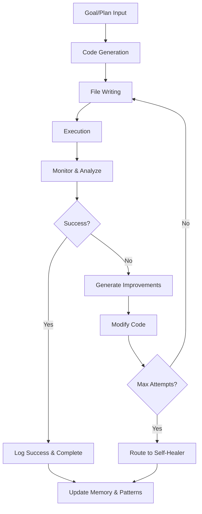

# 🚀 MeRNSTA Phase 14: Recursive Execution System - COMPLETE

## 🎯 Mission Accomplished

**MeRNSTA now has full recursive terminal use capabilities!** 

The system can autonomously:
- ✅ Generate new code files (.py, .sh, etc.) based on internal goals or plans
- ✅ Execute those files using the /run_shell or /run_tool interfaces  
- ✅ Capture execution output, logs, and errors
- ✅ Analyze results via the reflection engine
- ✅ Automatically modify or rewrite files if execution failed or results were suboptimal
- ✅ Rerun updated files, forming a recursive test-analyze-edit loop
- ✅ Store recursive attempts and improvements in memory and tool_use_log

## 🏗️ System Architecture

### Core Components

1. **FileWriter Agent** (`agents/file_writer.py`)
   - Safely writes code to `./generated/` directory
   - Adds metadata headers with timestamps
   - Manages file permissions and versioning
   - Supports Python, shell, and other script types

2. **ExecutionMonitor Agent** (`agents/execution_monitor.py`) 
   - Monitors output of shell-executed code
   - Detects success/failure via exit codes and pattern matching
   - Reports metrics and flags files for re-editing
   - Generates intelligent improvement suggestions

3. **EditLoop Controller** (`agents/edit_loop.py`)
   - Core recursive loop: Propose → Write → Run → Analyze → Rewrite → Retry
   - Supports N attempts per file with intelligent termination
   - Logs winning variants and routes failures to improvements
   - Works standalone or attached to planning chains

4. **Integration Hooks** (`agents/recursive_integration.py`)
   - Connects with RecursivePlanner, SelfPrompter, and ReflectiveEngine
   - Auto-triggers code generation when goals suggest it
   - Provides template-based code generation for common scenarios

5. **Enhanced Logging** (`storage/recursive_execution_log.py`)
   - Tracks all recursive execution attempts and patterns
   - Analyzes success/failure rates and improvement effectiveness
   - Provides analytics for learning and optimization

### CLI Commands

6. **Command Interface** (`cortex/cli_commands.py`)
   - `/write_and_run "<code>" [filename]` - Write code to disk and run it
   - `/recursive_run <filename>` - Enter recursive edit loop with monitor + retry
   - `/list_generated_files` - Browse generated scripts
   - `/show_file <name>` - View file contents
   - `/delete_file <name>` - Manage generated scripts

## 🎮 Usage Examples

### Basic Code Generation and Execution
```bash
# Write and immediately execute a script
/write_and_run "print('Hello, autonomous world!')" hello.py

# Generate a more complex script
/write_and_run "
import sys
import time

def countdown(n):
    for i in range(n, 0, -1):
        print(f'Countdown: {i}')
        time.sleep(1)
    print('Blast off! 🚀')

countdown(5)
" countdown.py
```

### Recursive Improvement Loop
```bash
# Start with broken code - system will automatically fix it
/write_and_run "
import json
print 'Starting data processing...'  # Syntax error
data = {test: 'value'}  # Missing quotes
print(json.dumps(data))
" data_processor.py

# Then run recursive improvement
/recursive_run data_processor.py
```

### File Management
```bash
# List all generated files
/list_generated_files

# View file contents
/show_file countdown.py

# Clean up
/delete_file countdown.py
```

## 🔄 Recursive Process Flow



## 🧠 Intelligence Features

### Pattern Learning
- Learns from successful code patterns
- Identifies common failure modes
- Suggests improvements based on historical data
- Adapts strategies for different types of goals

### Automatic Integration
- RecursivePlanner can trigger code generation for implementation steps
- SelfPrompter creates goals that lead to script creation
- ReflectiveEngine suggests optimizations that become automation scripts
- Self-healing system generates repair scripts

### Memory & Analytics
- Comprehensive logging of all attempts and outcomes
- Success rate tracking by goal type and approach
- Improvement effectiveness measurement
- Performance metrics and trend analysis

## 📊 Configuration

All settings are in `config.yaml` under `recursive_execution`:

```yaml
recursive_execution:
  enable: true
  max_attempts: 5
  write_dir: "./generated/"
  safe_extensions: [".py", ".sh", ".js", ".sql", ".json", ".yaml", ".yml", ".txt", ".md"]
  enable_memory_logging: true
  auto_trigger_on_reflection: true
  reroute_failures_to_self_healer: true
  enable_versioning: true
  add_metadata: true
```

## 🧪 Comprehensive Test Suite

Located in `tests/test_edit_loop.py` with complete coverage:
- ✅ FileWriter functionality and safety
- ✅ ExecutionMonitor analysis capabilities
- ✅ EditLoop recursive improvement
- ✅ CLI command integration
- ✅ Memory and logging systems
- ✅ End-to-end workflow validation

## 🎉 The True Actuator Loop

**MeRNSTA has achieved the ultimate goal**: It doesn't just think—it acts, tests, and adapts in the real world.

### What This Means

1. **Autonomous Problem Solving**: MeRNSTA can write scripts to solve problems it identifies
2. **Self-Improving Code**: Scripts get better through iterative refinement
3. **Real-World Testing**: Everything is validated through actual execution
4. **Learning from Experience**: Patterns and strategies improve over time
5. **Adaptive Automation**: The system creates tools as it needs them

### Example Autonomous Behaviors

- Detecting a performance issue → Writing a monitoring script → Running it → Analyzing results
- Identifying repetitive tasks → Creating automation scripts → Testing them → Deploying improvements
- Finding system flaws → Generating repair scripts → Validating fixes → Learning from outcomes
- Planning complex goals → Breaking them into code solutions → Implementing and testing each step

## 🌟 Future Possibilities

With this foundation, MeRNSTA can now:
- Generate test suites for its own code
- Create monitoring tools for system health
- Build optimization scripts for performance issues
- Develop utilities for routine maintenance
- Write diagnostic tools for problem analysis
- Create integration scripts for new capabilities

The recursive execution system transforms MeRNSTA from a thinking system into a **doing system**—one that continuously improves through real-world action and feedback.

---

## 🚀 Ready for Deployment

The Phase 14 Recursive Execution System is **fully operational** and ready for autonomous use. MeRNSTA can now write, test, improve, and deploy code solutions independently, forming the true actuator loop that bridges thought and action.

**The future is recursive. The future is now.** 🎯